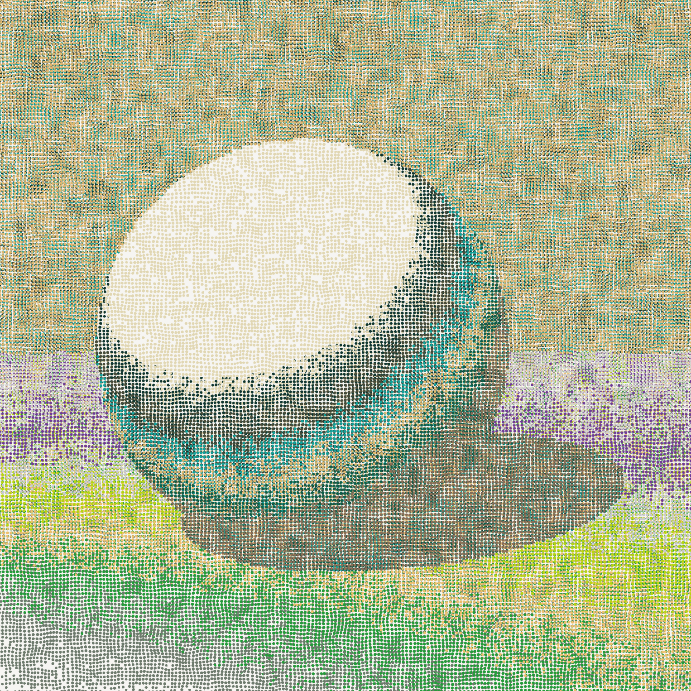

# sdf-js

<p align="center">
  
</p>

> **LLM-native generative art engine for vector / plotter / editorial illustration.**
> Built on Signed Distance Functions (SDF) — a paradigm where diffusion models structurally cannot compete.

---

## Why this exists

### The thesis (5 points)

1. **AI is the 4th industrial revolution.** Compute capability is reshaping how creative work happens.
2. **Coding is AI's strongest commercial vertical.** LLMs are far more reliable at writing code than at producing pixels.
3. **SDF + LLM is the native illustration paradigm — diffusion cannot reach it.** Diffusion models fail in any domain where structure must be *exact* (clocks, charts, maps, fonts, emoji, icons, architectural diagrams). They hallucinate visual plausibility but not geometric correctness. LLM × SDF generates **provably correct structure** because the LLM writes code, the code defines exact geometry, and rendering is deterministic. The Pasma / Tyler Hobbs plotter art tradition operates in exactly this space.
4. **Form × Renderer × Pattern × Motif-Library: 4 independent axes, each tradable as preset IP.** Same SDF rendered through different renderers (silhouette / stipple / Pasma lines / Lambert) × different pattern backgrounds (Truchet / Hilbert / Gosper / Motifs / none) × different motif libraries = combinatorial explosion of style space. Every axis is an artist-licensable asset class.
5. **→ A new creative-tool platform becomes possible** — not Photoshop (raster), not Illustrator (manual vector), not Midjourney (diffusion). Something else, where you describe in natural language and get **editable, exact, plotter-ready vector art**.

### The diffusion boundary (where we win)

Anything that requires **exact recognizable structure** is diffusion's failure mode:

| Domain | Why diffusion fails | Why SDF wins |
|---|---|---|
| Clocks showing specific times | Hallucinates plausible-looking clock faces with wrong/distorted numerals | Code defines 12 tick marks at exact angles, hour/minute hands at exact rotations |
| Emoji / icon design | Same emoji rendered slightly different each time → unrecognizable as the same symbol | Same SDF code produces pixel-identical output, every time |
| Editorial illustration with text labels | Garbles letters | Vector text composes geometrically |
| Architectural / engineering diagrams | Mangles right angles, parallel lines | Exact primitive composition |
| Pattern / textile / motif libraries | Cannot reproduce the same motif consistently | Motif data is loaded, not generated |
| Anything plotter-output (vector) | Outputs raster, must be vectorized lossy | Native vector polyline output |

This isn't a "diffusion is worse" claim — it's a **structural separation of domains**. Diffusion owns photo-realistic / impressionistic / "vibe" generation. We own everything that needs geometric exactness.

---

## What's in the box (current capability)

### 6 renderers × any SDF dim (2D or 3D)

Split into two implementation families. All renderers are polymorphic over SDF2 / SDF3 (12-cell matrix); the GPU family adds real-time interactivity.

**Canvas2D family — offline / vector-ready / SVG-exportable:**

| Renderer | What it does | Art-history lineage |
|---|---|---|
| **Silhouette** | Flat-color filled regions, sharp edges | Lotta Nieminen / editorial illustration |
| **Stipple (BOB)** | Multi-layer painterly brush stipple, SDF3 mode probes Lambert intensity → density modulation | Bonnard / post-impressionism / Aboriginal dot |
| **Lines (Pasma)** | Contour-following streamlines (2D) / 3D surface-wrap rayhatching (3D) | Piter Pasma / Universal Rayhatcher |
| **Lambert (canvas)** | Canvas-rendered raymarched diffuse shading | Standard 3D shading |

**GPU shader family — real-time, pointer-lock WASD, 60fps:**

| Renderer | What it does | Art-history lineage |
|---|---|---|
| **Fly 3D** | GPU Lambert + free-fly camera; preview & scene-composition mode | Standard 3D shading |
| **BOB GPU** | GPU quantized-palette spaceCol + 2-pass FBO sand painting + scene-wide palette parity lock | Erik Swahn Autoscope / Aboriginal dot meets Bonnard / generative grid |

Compile path: any SDF3 expression → GLSL via `sdf3.compile.js` (with optional `emitObjectIndex` for multi-object color separation). Same SDF tree feeds both canvas and GPU renderers.

### 4 background patterns (orthogonal axis)

Pattern is a third independent axis on top of `subject SDF × renderer`. Patterns auto-mask with subject silhouette (Pasma surreal-staging idiom) so they live behind/around the subject without overpainting it.

| Pattern | Algorithm | Output type |
|---|---|---|
| **None** | — | Plain bg / canvas-color |
| **Truchet** | Smith arcs on uniform grid | Plotter-vector |
| **Gosper** | L-system flowsnake (hexagonal triskele) | Plotter-vector |
| **Motifs** | Reinder Nijhoff-style hand-drawn motif library × 3-band uniform grid sweep | Plotter-vector |

(`Hilbert` recursive space-filling curve is still exported from `src/render/spaceCurve.js` for library users but retired from the MVP pill rail in favor of Gosper's stronger visual contrast.)

### SDF library (40+ primitives)

- 2D: ellipse / rectangle / hexagon / star / heart / arc / segment / 30+ more
- 3D: sphere / box / capsule / torus / cylinder / cone / etc.
- 2D→3D operators: `.extrude(h)`, `.revolve(offset)` — turns 2D primitives into 3D shapes
- 3D operators: `.twist(k)`, `.bend(k)`, elongate
- Boolean: `union` / `intersection` / `difference` with smooth-k blending
- Domain rep: `.rep([px, py], opts)` for tiled instances

### Output formats

- Canvas (interactive) — all renderers
- SVG (vector, axidraw/Illustrator/Figma) — Lines renderer
- (planned) STL marching-cubes for 3D printing
- (planned) GIF/MP4 for animation

### LLM-driven MVP

`examples/mvp/` — text prompt → Anthropic Claude → SDF JS code → render. Live editable in-browser, history persisted, all 4 renderers × 5 patterns selectable.

---

## Architecture

```
src/
├── sdf/         primitives + booleans + transforms + probe + raymarching
├── field/       noise / scalar fields (procedural)
├── streamline/  curve tracing (Pasma rayhatching core)
├── motifs/      hand-crafted SVG path library (Reinder Nijhoff default set)
├── ca/          cellular automata over SDFs (kjetil-golid-derived)
├── render/      output consumers: silhouette / stipple / hatch / Lambert / pattern family / motifGrid
├── palette/     BOB / Fidenza / generative color schemes
└── math/        easing curves
```

Core philosophy:

- **Form / Render / Pattern decoupling**: any SDF + any renderer + any pattern = valid output
- **Probe abstraction**: all 3D renderers consume same 4-value probe `{intensity, region, hit, normal}` — single source of truth for camera + lighting + raymarching
- **Generative ≠ procedural**: hand-curated data (motif libraries, presets) often beats algorithmic generation for organic feel (validated against Pasma reference)

---

## Run demos

```bash
cd sdf-js
python3 dev-server.py 8001            # dev server with no-store cache header
open http://localhost:8001/examples/
```

### Highlights

| Demo | Path |
|---|---|
| **MVP** — text → SDF (Anthropic API) | `examples/mvp/` |
| **Streamline scenes** — Pasma 2D + 3D rayhatching gallery | `examples/sdf/streamline-scenes.html` |
| **Painted scenes** — BOB stipple gallery (incl. 3D scenes 15+16) | `examples/sdf/painted-scenes.html` |
| **3D fly camera tuning** — pointer-lock WASD scene composition | `examples/sdf/test-pasma-capsules.html` |
| **Render showcase** — 4 renderers × same SDF set | `examples/sdf/render-showcase.html` |
| **Editor** — interactive SDF construction | `examples/sdf/editor.html` |

---

## Quick API tour

```js
import { circle, sphere, capsule, union, render } from './sdf-js/src/index.js';

// 2D: a flower
const petal = circle(0.3).translate([0.5, 0]);
const flower = union(...Array.from({length: 6}, (_, i) =>
  petal.rotate(i * Math.PI / 3)
));

// Render as silhouette
render.silhouette(ctx, [{ sdf: flower, color: [200, 80, 100] }], { view: 1 });

// Or as Pasma streamlines (vector, axidraw-ready)
render.hatch(ctx, [{ sdf: flower, color: '#222' }], { view: 1 });

// 3D: a wine bottle
const bottle = polygon([...profile]).revolve(0);
render.raymarched(ctx, [{ sdf: bottle, color: [0.2, 0.6, 0.9] }], { view: 1.2 });
```

---

## Roadmap

### The 4-page Compositor architecture (current target)

Input is the new axis. The current MVP ships one input path (LLM text prompt → SDF). The next phase splits the input layer into **four orthogonal sources**, all emitting the same **SceneData** format, all consumed by the same renderer pool:

```
   ┌─ text-mode      (LLM prompt → SceneData)      ─┐
   ├─ generator-mode (autoscope-style PRNG → Data)  ─┤
   │                                                ├→ SceneData → renderer pool (silhouette / stipple / lines / Lambert / BOB-GPU × 5 patterns)
   ├─ 2d-edit-mode   (node-graph editor → Data)    ─┤
   └─ 3d-edit-mode   (viewport editor → Data)      ─┘
```

**Three architectural decisions** (locked 2026-05-17):

1. **SceneData is the lingua franca.** All four inputs emit the same JSON-able shape (`subjects + ground + defaults.camera + defaults.light + regions`). Without this, the four inputs become silos and the Compositor can't unify them.
2. **The 2D editor is a non-destructive SDF node graph, not a PPT clone.** PPT "merge shapes" is destructive — operands are deleted on boolean. We keep operands as editable child nodes. This non-destructive boolean is SDF's structural advantage over PowerPoint, Illustrator, and diffusion. UI may borrow PPT's drag-and-drop feel, but the substrate is a node tree.
3. **MVP folds into Compositor as a `text-mode` tab.** Four pages, not five. One shared renderer pool, one palette control surface, one camera widget. The existing `examples/mvp/` URL stays alive via redirect.

### 6 milestones (9–11 weeks)

| M | Goal | Time | Depends on | Output |
|---|---|---|---|---|
| **M0** | Scene data spec | 3–5 days | — | `src/scene/spec.js + compile.js + serialize.js`; autoscope-scenes refactor validates spec |
| **M1** | Compositor v0 | 5–7 days | M0 | 4-tab UI + renderer pool; `text` + `generator` tabs functional |
| **M2** | Generator framework | 5–7 days | M0 | `src/generator/`; autoscope re-expressed as a Generator instance; +1–2 new templates |
| **M3** | 2D node-graph editor | 2–3 weeks | M0 | viewport + primitive palette + boolean nodes + outliner + undo |
| **M4** | 3D viewport editor | 3–4 weeks | M0 | three.js viewport + transform gizmo + 3D primitive panel + SceneData output |
| **M5** | LLM emits SceneData | 1–2 weeks | M0, M1 | SKILL.md rewrite → LLM outputs SceneData JSON → editable in 2D/3D editors |
| **M6** | LLM emits Generator function | 1–2 weeks | M2, M5 | LLM writes `(hash) → SceneData` → autoscope-style generative output from prompt |

Critical path: M0 → M1 → M2 → M3/M4 → M5 → M6. M3 and M4 can run in parallel after M0 lands.

### Why this matters

This is Point 4 (multi-axis decoupling) extended from the **output side** (renderer × pattern × motif library) to the **input side** (LLM × generator × 2D-edit × 3D-edit). Every input source becomes a tradable asset class in the marketplace economy:

- **LLM prompt presets** → editorial authors
- **Generator templates** → autoscope-lineage generative artists
- **2D scene presets** → Lotta-style illustrators
- **3D scene presets** → product / icon set designers

M5 and M6 are the *terminal* commercial-thesis demonstrations: LLM produces *editable* output (M5) and *generators* (M6) — neither of which diffusion can structurally reach.

### What's still on the bench

- **STL export** (marching cubes for 3D printing) — unlocks physical fabrication market; queued after M3
- **`text(font, str)` → SDF** — capability blocker for PPT titles + emoji text + logo work; queued after M2
- **SVG export polish** — Lines renderer already emits paths; tighten for Illustrator / axidraw round-trip
- **Voronoi / Delaunay pattern variants** — additional cells in the pattern axis

---

## TAM segments (where we're aimed)

1. **Editorial illustration** — Lotta Nieminen tradition; magazine / book / poster art. Same single artist creates 5-50 illustrations per year, each $500-5000 commission.
2. **Presentation visuals (PPT / Keynote / Gamma)** — AI-PPT generation tools (Gamma, Tome, Beautiful.ai) solve text but leave the visual layer dead. Our preset library composes 30-50 visuals per deck sharing one style.
3. **Emoji / icon / sticker** — recognition depends on exact structure. WeChat / LINE / Slack emoji packs are billion-yuan markets. Diffusion structurally cannot make a consistent emoji set; we natively can.

These three segments share one supply-side property: **the visual is reused at multiplied scale** (one motif used 30× across a deck; one icon set used by millions; one preset applied to 100 editorial pieces). Diffusion's per-generation cost is a tax on this supply economy. SDF's deterministic preset model is the inverse — supply compounds.

---

## Origins

Started as a JavaScript port of [fogleman/sdf](https://github.com/fogleman/sdf) (Python, marching-cubes mesh export). Has since diverged into an interactive vector + plotter + LLM-native creative engine, with its own renderers, pattern layer, motif library, scene engine, and MVP. The Python original is unmaintained — see git history pre-2026-05-15 for the legacy archive.

---

## License

MIT — see [LICENSE.md](./LICENSE.md). Original SDF primitives © Michael Fogleman; JS port, extensions, renderer family, motif library, scene engine © 2024–.
