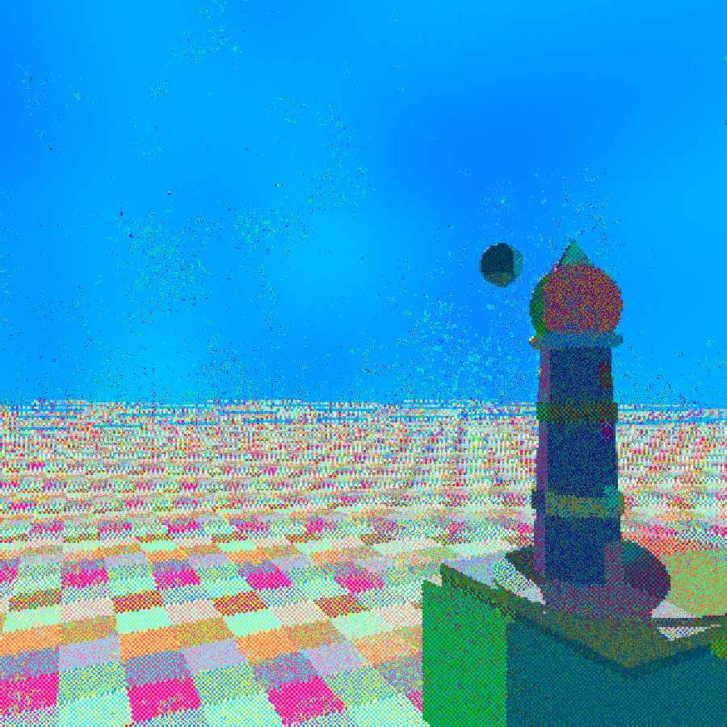
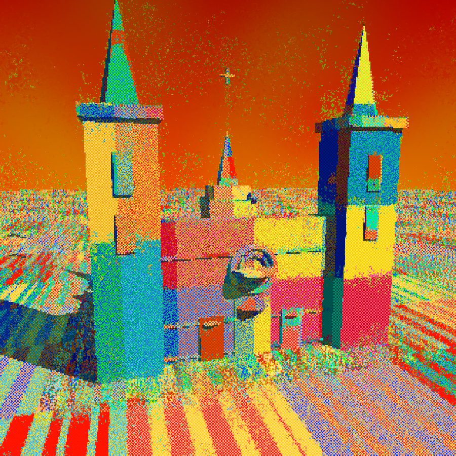

# Atlas

[](docs/lighthouse-v2.png)

*Prompt: `海边的灯塔` (5 characters). Same prompt + same 2D code, lifted twice — once with the v1 lift prompt (no semantic types taught) and once with the v2 prompt (18 named atom + component types). v1 emit: 0 atoms (the original 3D had no moon and no stars). v2 emit: **moon × 1, star × 15, plus the tower** shown here. The library expansion → prompt rewrite → atom emission is a fully quantified loop — [scripts/regression](sdf-js/scripts/regression/README.md) reproduces the result for $0.07 per demo.*

[**→ Try the live gallery**](https://shaun8149.github.io/sdf-js/) · no API key needed, click any of 8 pre-lifted scenes and fly through with WASD.

[](docs/cathedral1.png) [](docs/cathedral2.png)

*Prompt: `一座哥特式大教堂` (6 characters). 2D code: emitted but failed to render (closing-vertex bug in one `polygon` call). 3D scene: read by the lift LLM as semantic structure (twin towers + rose window + lancet portals + flying buttresses + crossing tower), compiled into editable SceneData, rendered via BOB GPU.
**Two parallel pipelines from prompt to viewer — only one needs to succeed.** Diffusion has one.*

> **Atlas — the LLM-native illustration platform.** An *atlas* in differential geometry is a collection of charts covering a manifold. Here it's a collection of *forms × renderers × patterns × scenes* — composed via four orthogonal input sources (LLM prompt, generator, 2D editor, 3D editor) into a single renderer pool.
> Built on **sdf-js** — the underlying open-source SDF library. Signed distance functions are a paradigm where diffusion models structurally cannot compete.

---

## Why this exists

### The thesis (5 points)

1. **AI is the 4th industrial revolution.** Compute capability is reshaping how creative work happens.
2. **Coding is AI's strongest commercial vertical.** LLMs are far more reliable at writing code than at producing pixels.
3. **SDF + LLM is the native illustration paradigm — diffusion cannot reach it.** Diffusion models fail in any domain where structure must be *exact* (clocks, charts, maps, fonts, emoji, icons, architectural diagrams). They hallucinate visual plausibility but not geometric correctness. LLM × SDF generates **provably correct structure** because the LLM writes code, the code defines exact geometry, and rendering is deterministic. The Pasma / Tyler Hobbs plotter art tradition operates in exactly this space.
4. **Form × Renderer × Pattern × Motif-Library: 4 independent axes, each tradable as preset IP.** Same SDF rendered through different renderers (silhouette / stipple / Pasma lines / Lambert) × different pattern backgrounds (Truchet / Hilbert / Gosper / Motifs / none) × different motif libraries = combinatorial explosion of style space. Every axis is an artist-licensable asset class.
5. **→ A new creative-tool platform becomes possible** — not Photoshop (raster), not Illustrator (manual vector), not Midjourney (diffusion). Something else, where you describe in natural language and get **editable, exact, plotter-ready vector art**.

### The diffusion boundary (where we win)

This is a **structural separation of domains**, not a "diffusion is worse" claim. Diffusion owns photo-realistic / impressionistic / "vibe" generation. We own everything that needs geometric exactness:

| Domain | Why diffusion fails | Why SDF wins |
| --- | --- | --- |
| Clocks showing specific times | Hallucinates plausible-looking clock faces with wrong/distorted numerals | Code defines 12 tick marks at exact angles, hour/minute hands at exact rotations |
| Emoji / icon design | Same emoji rendered slightly different each time → unrecognizable as the same symbol | Same SDF code produces pixel-identical output, every time |
| Editorial illustration with text labels | Garbles letters | Vector text composes geometrically |
| Architectural / engineering diagrams | Mangles right angles, parallel lines | Exact primitive composition |
| Pattern / textile / motif libraries | Cannot reproduce the same motif consistently | Motif data is loaded, not generated |
| Anything plotter-output (vector) | Outputs raster, must be vectorized lossy | Native vector polyline output |

### The architecture boundary (where we differ from three.js / Unity / mesh-pipeline AI)

The diffusion boundary above is about input *modality* (pixel-sampling vs symbolic structure). This second boundary is about *system architecture* — what kind of 3D substrate the AI is generating into. Same active-concession pattern: each system below is excellent within its own architecture; the question is *which architecture is reachable by an LLM writing code*.

**A rung map across existing 3D systems** — by state shape × loop contract × LLM writability:

| | Representative system | State shape | Loop contract | LLM writes natively? |
| --- | --- | --- | --- | --- |
| **rung-0** | three.js (static, one `renderer.render()` call) | Sampled mesh tree | Optional | No — RPC into renderer only |
| **rung-1** | p5 sketch | Globals + `frameCount` | Required, no purity contract | Partially (short sketches only) |
| **rung-1.5** | three.js + user-written `animate()` | Mesh tree + keyframe tween | User code, no enforced contract | Tween yes, mesh no |
| **rung-2** | Unity / Unreal / Bevy | ECS components on GameObjects | Enforced `Update()` per system | Possible but engineering-heavy |
| **rung-2 LLM-native** | **Atlas / M7** | **SDF symbolic tree + `Rule[]`** | **Pure `step()`** | **Yes — native fit** |

three.js sits at **rung 1.5** — it has mesh state (great for rendering) but no enforced loop contract (dynamics are user code). The same three.js app can be entirely static, keyframe-animated, or coupled to a physics engine — three.js doesn't pick. That's why the clean shorthand below is "graph without a loop contract."

**Why mesh-pipeline AI (VAST Eden, Tripo, Sloyd, Meshy) is structurally locked out of the rung-2 world-model market:**

1. **Output is a mesh asset.** An LLM cannot natively edit a 50k-vertex array — only regenerate it (one forward pass → one new mesh). Iteration is resampling, not editing. The same per-generation cost curve diffusion suffers from (see the diffusion boundary table above) applies here too — every variant is another full inference.
2. **No loop contract.** Dynamics requires bolting on Bullet / PhysX — another subsystem the LLM cannot natively write. The "LLM writes the laws of the world" claim collapses because the laws live inside a black-box physics solver.
3. **State is fragmented.** Mesh arrays + transform matrices + physics-engine internal buffers = three disjoint stores. **State is not a document.** Savegame-native persistence is impossible without architectural surgery.

Atlas inverts each of these:

1. **Output is an SDF expression tree.** The LLM *is* writing expressions.
2. **Loop contract is `step(world, actions, dt) → newWorld`, a pure function.** The LLM *is* writing functions.
3. **State is one `World` object.** Savegame *is* serializing it. ([Determinism CI](sdf-js/scripts/world/test-determinism.mjs) verifies this is bit-equal across replay.)

**The clean summary:**

- **p5** is "loop without a graph."
- **three.js** is "graph without a loop contract."
- **Unity** is "graph + loop contract, but state is an asset and dynamics is a C# project."
- **Atlas / M7** is **"symbolic graph + pure loop contract"** — both axes explicit, both axes LLM-writable.

Or shorter still:

> **three.js lets the LLM call the renderer; Atlas lets the LLM write the world.**

### Why this architecture beats diffusion — 10 axes

Across four themes, ten architectural advantages distinguish a code-based SDF generator from a statistical pixel sampler. The conclusion is at the bottom.

**A. Structural correctness**

1. **Exact structural detail.** Every primitive is a function. Clocks show the right time. Bicycles have two wheels of the right size at the right angle. Letters spell words. Diffusion hallucinates plausible-looking but structurally broken output in any precision-content domain (charts, maps, fonts, mechanical drawings).

2. **Infinite semantic composition.** Boolean algebra (union / difference / intersection) plus numerical coordinates plus domain operators (rep / mirror / twist / bend) lets any scene be expressed as a finite, *auditable*, *editable* tree of named operations. Diffusion has no compositional algebra; composition is emergent from the training distribution, not first-class.

3. **Native infinite resolution.** SDF is a continuous function — sharp at any zoom. Vector / plotter / print pipelines plug in directly. Diffusion is locked to a pixel grid; super-resolution requires lossy upscalers.

**B. Auditability**

4. **Auditable bias, bias-free visual layer.** The LLM still carries cultural bias in its language understanding, but the *visual* output layer is bias-free — the renderer is user-curated, inspectable code. Same SDF can render in 50 visual styles because the renderer is decoupled. Diffusion's bias is encoded in latent weights, opaque, and inherited by every output.

5. **Determinism / reproducibility.** Same SceneData → same output, pixel-identical. Essential for emoji sets, icon families, brand assets, character consistency. Diffusion samples stochastically; getting the same emoji style across an entire pack is the fundamental problem diffusion-based sticker tools can't solve.

**C. UX**

6. **Prompt is specification, not incantation.** Domain-language prompts ("a wine bottle on a table") still matter — but the diffusion-era visual incantation prompts ("trending on artstation, 8k uhd, masterpiece, hyperrealistic, ...") become obsolete. The LLM understands shape; we don't need keyword-magic to produce quality.

7. **Editability / iterative loop.** The output is code / data, not raster. Change one subject's radius, re-render — everything else stays bit-identical. Diffusion outputs raster; partial edits require inpainting, which breaks lighting consistency and style coherence. The client-revision workflow that takes 5 rounds in diffusion takes 5 field-edits in Atlas.

**D. Economics**

8. **LLM cost-down beneficiary.** Diffusion: quality ↑ → diffusion steps ↑ / model size ↑ → cost per image ↑. Atlas: LLM capability ↑ → better SDF → same flat cost per image (one LLM call + cheap SDF eval). LLM token prices are on a long-term cost-down curve; we ride that trajectory directly.

9. **Multi-axis combinatorial supply.** Form × Renderer × Pattern × Motif × Scene = O(N⁵) outputs from O(N) primitive inputs. One SDF rendered through 5 renderers = 5 emotional registers. One renderer × 4 patterns = 4 backgrounds. The supply economy compounds across orthogonal axes. Diffusion: 1 prompt = 1 output; each new variant requires another full inference pass.

10. **Zero-marginal-cost variants.** *Once an SDF is generated*, render-time randomization (palette shuffle, autoscope knobs of mirror/twist/grid-rotation, scene-hash PRNG) yields *infinite further visual variants* with **no additional LLM tokens consumed**. Autoscope-clone is the proof: one SceneData × thousands of PRNG hashes × 21 palettes = thousands of distinct images, total marginal cost ≈ GPU shader eval. This is orthogonal to #9: #9 is cross-product across *axes*, #10 is seed-randomization *within an axis*.

### Conclusion

> **Diffusion is, at its core, a statistical sampler. Atlas is a world simulator with an LLM as its physicist.**

World models have three rungs:

| Rung | Mechanism | Future is… | Example |
| --- | --- | --- | --- |
| **1. Scripted** | `f(t) → state` — a timeline plays back a predetermined trajectory | authored | animation, cutscenes |
| **2. Simulated** | `f(state_t, action) → state_t+1` — a transition function computes the next state | computed | game engines, physics sims |
| **3. Learned** | the transition function itself is a trained model | predicted | Genie-class research |

Video-generation approaches attempt rung 3 directly and lose the explicit state along the way: the world is compressed into pixels, objects vanish when the camera looks away, and no two players can share one world. Atlas takes the opposite route — a fully explicit, auditable world state (**SceneData**), with transition rules **written as code by an LLM**.

To be precise about what we claim: **Atlas is not a world model. It is a world-spec language today, and a rung-2 world simulator on the current roadmap (M7)** — with the LLM, rather than a human engineer, writing the physics and the game rules. Every tick is a JSON diff: replayable, forkable, diffable, multiplayer-shareable. Worlds are **savegame-native** — persistence costs nothing because the state *is* a document. That is the part of the world-model stack that pixel-based approaches structurally cannot offer, no matter how much compute they burn.

**For readers from the generative-art tradition** (Processing / p5.js / Pasma / Tyler Hobbs / BOB lineage): **Atlas's runtime is a p5-style draw loop with one consequential rewrite — the tick body is a pure function. That single discipline turns a rendering loop into a simulator — savegame-native, forkable, multiplayer-ready — without changing the loop's shape at all.** p5's `draw()` reads globals, calls `random()`, mutates canvas mid-frame; Atlas's `step(world, actions, dt) → newWorld` does none of those things. The shape you already know — minus the impurities. (See [docs/M7-SPEC.md](docs/M7-SPEC.md); determinism CI at `sdf-js/scripts/world/test-determinism.mjs` proves bit-equal replay across 600 ticks.)

This aligns with cognitive-science models of perception (objects-with-properties-and-relations) and with Marr's 2.5D / 3D representation hierarchy: diffusion stops at the 2D pixel layer, Atlas operates at the 3D representation layer with rendering as the projection step. Diffusion learns a distribution of pixel surfaces — its "understanding" of a red train is the probability cloud of pixels that historically depicted red trains. Atlas constructs a latent geometric world specification — its "understanding" of a train is an executable composition of cylinders, boxes, wheels, with explicit spatial relations.

The LLM is the reasoning engine; SDF is the world-spec geometry language. Together: an LLM-driven world *simulator*, where the user authors *the laws of the world*, not samples from a fixed viewing distribution.

### Beyond ℝ³ — dimension-agnostic worlds

SDF is dimension-agnostic: a signed distance field is a function `d(p): ℝⁿ → ℝ`, defined for any n, not just n = 3. Atlas's `dn.js` primitives already operate in arbitrary dimensions — this is not a future feature, it is a property of the math.

A 4D world in Atlas is a SceneData with one extra coordinate, rendered by **slicing**: the camera becomes a moving hyperplane `w = c`, and a hypersphere appears as a sphere that grows and shrinks as you scrub through w. The same WASD fly camera plus one scroll axis is a complete 4D explorer.

This is the deepest consequence of the spec-first route. **Video-based world models can only learn worlds that have been filmed; a world-spec language can define worlds that have never appeared.** Diffusion models a distribution over our world's appearances. An SDF + transition-rule stack can simulate non-Euclidean spaces, 4D mechanics, and counterfactual physics — anywhere a distance function and an update rule can be written, a world can run.

A minimal 4D slice-explorer demo is queued on the bench (see roadmap) so this section's claim ships with a reproducible artifact, not just an argument.

---

## What's in the box (current capability)

### 6 renderers × any SDF dim (2D or 3D)

Split into two implementation families. All renderers are polymorphic over SDF2 / SDF3 (12-cell matrix); the GPU family adds real-time interactivity.

**Canvas2D family — offline / vector-ready / SVG-exportable:**

| Renderer | What it does | Art-history lineage |
| --- | --- | --- |
| **Silhouette** | Flat-color filled regions, sharp edges | Lotta Nieminen / editorial illustration |
| **Stipple (BOB)** | Multi-layer painterly brush stipple, SDF3 mode probes Lambert intensity → density modulation | Bonnard / post-impressionism / Aboriginal dot |
| **Lines (Pasma)** | Contour-following streamlines (2D) / 3D surface-wrap rayhatching (3D) | Piter Pasma / Universal Rayhatcher |
| **Lambert (canvas)** | Canvas-rendered raymarched diffuse shading | Standard 3D shading |

**GPU shader family — real-time, pointer-lock WASD, 60fps:**

| Renderer | What it does | Art-history lineage |
| --- | --- | --- |
| **Fly 3D** | GPU Lambert + free-fly camera; preview & scene-composition mode | Standard 3D shading |
| **BOB GPU** | GPU quantized-palette spaceCol + 2-pass FBO sand painting + scene-wide palette parity lock | Erik Swahn Autoscope / Aboriginal dot meets Bonnard / generative grid |

Compile path: any SDF3 expression → GLSL via `sdf3.compile.js` (with optional `emitObjectIndex` for multi-object color separation). Same SDF tree feeds both canvas and GPU renderers.

### 4 background patterns (orthogonal axis)

Pattern is a third independent axis on top of `subject SDF × renderer`. Patterns auto-mask with subject silhouette (Pasma surreal-staging idiom) so they live behind/around the subject without overpainting it.

| Pattern | Algorithm | Output type |
| --- | --- | --- |
| **None** | — | Plain bg / canvas-color |
| **Truchet** | Smith arcs on uniform grid | Plotter-vector |
| **Gosper** | L-system flowsnake (hexagonal triskele) | Plotter-vector |
| **Motifs** | Reinder Nijhoff-style hand-drawn motif library × 3-band uniform grid sweep | Plotter-vector |

(`Hilbert` recursive space-filling curve is still exported from `src/render/spaceCurve.js` for library users but retired from the MVP pill rail in favor of Gosper's stronger visual contrast.)

### SDF library (40+ primitives)

- 2D: ellipse / rectangle / hexagon / star / heart / arc / segment / 30+ more
- 3D: sphere / box / capsule / torus / cylinder / cone / etc.
- 2D→3D operators: `.extrude(h)`, `.revolve(offset)` — turns 2D primitives into 3D shapes
- 3D operators: `.twist(k)`, `.bend(k)`, elongate
- Boolean: `union` / `intersection` / `difference` with smooth-k blending
- Domain rep: `.rep([px, py], opts)` for tiled instances

### Output formats

- Canvas (interactive) — all renderers
- SVG (vector, axidraw/Illustrator/Figma) — Lines renderer
- (planned) STL marching-cubes for 3D printing
- (planned) GIF/MP4 for animation

### LLM-driven MVP

`examples/mvp/` — text prompt → Anthropic Claude → SDF JS code → render. Live editable in-browser, history persisted, all 4 renderers × 5 patterns selectable.

---

## Architecture

```
sdf-js/src/
├── sdf/          shape algebra
│                 ├── d2.js / d3.js / dn.js       2D + 3D primitives, dim-agnostic ops
│                 ├── core.js                     SDF2 / SDF3 classes, defineOp* registrar
│                 ├── probe.js                    4-value contract {intensity, region, hit, normal}
│                 ├── raymarch.js                 CPU raymarching for canvas2D renderers
│                 ├── sdf2.glsl.js                2D SDF → GLSL compilation
│                 ├── sdf3.glsl.js                3D SDF → GLSL compilation
│                 ├── sdf3.compile.js             scene tree → fragment shader (with emitObjectIndex)
│                 ├── time.js                     time-aware primitive wrappers
│                 └── vec.js / vec2.js            math primitives
├── scene/        SceneData v1 — 4-input lingua franca (M0, locked 2026-05-17)
│                 ├── SPEC.md                     single source of truth for the format
│                 ├── spec.js                     (M0 d2-3) validator + JSDoc types
│                 ├── compile.js                  (M0 d2-3) SceneData → SDF tree + camera + light + regionFn
│                 └── serialize.js                (M0 d2-3) parse / stringify / version migration
├── render/       output consumers (6 renderers + pattern family)
│                 ├── silhouette / bobStipple / hatch / raymarched   canvas2D family
│                 ├── flyLambert / bobShader                          GPU shader family
│                 ├── truchet / spaceCurve (Hilbert/Gosper) / motifGrid   pattern family
│                 └── bands / sand / painted / flowLines / lineTile / tileGrid   legacy / supporting
├── field/        scalar fields (procedural) — noise / proto
├── streamline/   Pasma rayhatching core (2D contour-following, 3D surface-wrap)
├── motifs/       hand-crafted SVG path library (Reinder Nijhoff default set + path parser)
├── palette/      BOB / Fidenza / Tyler Hobbs / Autoscope color schemes
├── ca/           cellular automata over SDFs (kjetil-golid-derived)
├── input/        pointer-lock WASD fly camera (shared between Fly 3D and BOB GPU)
└── math/         easing curves
```

### Core philosophy

- **Form / Render / Pattern / Source — 4 orthogonal axes**: any (SceneData / SDF tree) × any renderer × any pattern × any source = valid output. **`scene/` is the new lingua franca**: all four Compositor input sources (LLM, generator, 2D editor, 3D editor) emit the same SceneData shape; the renderer pool consumes it.
- **Canvas + GPU dual path, single SDF tree**: the same SDF expression compiles to canvas2D raymarching (offline / SVG-ready) **and** to WebGL fragment shaders (real-time / WASD / 60fps). Form / renderer decoupling proven at the implementation layer — see `sdf3.compile.js`.
- **Probe abstraction**: all canvas2D 3D renderers consume the same 4-value probe `{intensity, region, hit, normal}` — single source of truth for camera + lighting + raymarching. Same probe contract is honored by the GPU compile path.
- **Generative ≠ procedural**: hand-curated data (motif libraries, presets, scene templates) often beats algorithmic generation for organic feel. Validated against Pasma (Reinder Nijhoff Turtletoy) and Autoscope (Erik Swahn) references.
- **Subject ID stability**: SceneData subject ids are source-assigned and round-trip-stable, enabling iterative LLM edits ("make sphere-1 bigger"), undo/redo in editors, and deterministic generator output.

---

## Run demos

```
cd sdf-js
python3 dev-server.py 8001            # dev server with no-store cache header
open http://localhost:8001/examples/
```

### Highlights

| Demo | Path |
| --- | --- |
| **MVP** — text → SDF (Anthropic API) | `examples/mvp/` |
| **Streamline scenes** — Pasma 2D + 3D rayhatching gallery | `examples/sdf/streamline-scenes.html` |
| **Painted scenes** — BOB stipple gallery (incl. 3D scenes 15+16) | `examples/sdf/painted-scenes.html` |
| **3D fly camera tuning** — pointer-lock WASD scene composition | `examples/sdf/test-pasma-capsules.html` |
| **Render showcase** — 4 renderers × same SDF set | `examples/sdf/render-showcase.html` |
| **Editor** — interactive SDF construction | `examples/sdf/editor.html` |

---

## Quick API tour

```js
import { circle, sphere, capsule, union, render } from './sdf-js/src/index.js';

// 2D: a flower
const petal = circle(0.3).translate([0.5, 0]);
const flower = union(...Array.from({length: 6}, (_, i) =>
  petal.rotate(i * Math.PI / 3)
));

// Render as silhouette
render.silhouette(ctx, [{ sdf: flower, color: [200, 80, 100] }], { view: 1 });

// Or as Pasma streamlines (vector, axidraw-ready)
render.hatch(ctx, [{ sdf: flower, color: '#222' }], { view: 1 });

// 3D: a wine bottle
const bottle = polygon([...profile]).revolve(0);
render.raymarched(ctx, [{ sdf: bottle, color: [0.2, 0.6, 0.9] }], { view: 1.2 });
```

---

## Roadmap

> **Where we are right now**: see [docs/STATUS.md](docs/STATUS.md) for the current milestone tracker, locked decisions, and ship status.

### The 4-page Compositor architecture (current target)

Input is the new axis. The current MVP ships one input path (LLM text prompt → SDF). The next phase splits the input layer into **four orthogonal sources**, all emitting the same **SceneData** format, all consumed by the same renderer pool:

```
┌─ text-mode      (LLM prompt → SceneData)      ─┐
├─ generator-mode (autoscope-style PRNG → Data)  ─┤
│                                                ├→ SceneData → renderer pool (silhouette / stipple / lines / Lambert / BOB-GPU × 5 patterns)
├─ 2d-edit-mode   (node-graph editor → Data)    ─┤
└─ 3d-edit-mode   (viewport editor → Data)      ─┘
```

**Three architectural decisions** (locked 2026-05-17):

1. **SceneData is the lingua franca.** All four inputs emit the same JSON-able shape (`subjects + ground + defaults.camera + defaults.light + regions`). Without this, the four inputs become silos and the Compositor can't unify them.
2. **The 2D editor is a non-destructive SDF node graph, not a PPT clone.** PPT "merge shapes" is destructive — operands are deleted on boolean. We keep operands as editable child nodes. This non-destructive boolean is SDF's structural advantage over PowerPoint, Illustrator, and diffusion. UI may borrow PPT's drag-and-drop feel, but the substrate is a node tree.
3. **MVP folds into Compositor as a `text-mode` tab.** Four pages, not five. One shared renderer pool, one palette control surface, one camera widget. The existing `examples/mvp/` URL stays alive via redirect.

### 7 milestones

| M | Goal | Time | Depends on | Output |
| --- | --- | --- | --- | --- |
| **M0** | Scene data spec | 3–5 days | — | `src/scene/spec.js + compile.js + serialize.js`; autoscope-scenes refactor validates spec |
| **M1** | Compositor v0 | 5–7 days | M0 | 4-tab UI + renderer pool; `text` + `generator` tabs functional |
| **M2** | Generator framework | 5–7 days | M0 | `src/generator/`; autoscope re-expressed as a Generator instance; +1–2 new templates |
| **M3** | 2D node-graph editor | 2–3 weeks | M0 | viewport + primitive palette + boolean nodes + outliner + undo |
| **M4** | 3D viewport editor | 3–4 weeks | M0 | three.js viewport + transform gizmo + 3D primitive panel + SceneData output |
| **M5** | LLM emits SceneData | 1–2 weeks | M0, M1 | SKILL.md rewrite → LLM outputs SceneData JSON → editable in 2D/3D editors |
| **M6** | LLM emits Generator function | 1–2 weeks | M2, M5 | LLM writes `(hash) → SceneData` → autoscope-style generative output from prompt |
| **M7** | LLM emits Transition rules | 2–3 weeks | M5, M6 | LLM writes `step(SceneData_t, actions, dt) → SceneData_t+1` as auditable JS; runtime executes per tick. Unlocks counterfactual intervention (grab the rocket mid-flight), emergent failure (insufficient thrust → it falls), and savegame-native persistent worlds |

Critical path: M0 → M1 → M2 → M3/M4 → M5 → M6 → M7. M3 and M4 can run in parallel after M0 lands.

### Why this matters

This is Point 4 (multi-axis decoupling) extended from the **output side** (renderer × pattern × motif library) to the **input side** (LLM × generator × 2D-edit × 3D-edit). Every input source becomes a tradable asset class in the marketplace economy:

- **LLM prompt presets** → editorial authors
- **Generator templates** → autoscope-lineage generative artists
- **2D scene presets** → Lotta-style illustrators
- **3D scene presets** → product / icon set designers

M5 and M6 are the commercial-thesis demonstrations: LLM produces *editable* output (M5) and *generators* (M6) — neither of which diffusion can structurally reach. **M7 is the world-simulator demonstration**: the same explicit-state architecture that makes output editable also makes worlds *runnable* — the M6 signature `(hash) → SceneData` becomes the M7 signature `(SceneData, action) → SceneData`, and Atlas crosses from generating worlds to simulating them.

### What's still on the bench

- **STL export** (marching cubes for 3D printing) — unlocks physical fabrication market; queued after M3
- **`text(font, str)` → SDF** — capability blocker for PPT titles + emoji text + logo work; queued after M2
- **SVG export polish** — Lines renderer already emits paths; tighten for Illustrator / axidraw round-trip
- **Voronoi / Delaunay pattern variants** — additional cells in the pattern axis
- **4D slice-explorer demo** — a hypersphere / tesseract SceneData with a `w`-axis slicing camera (existing WASD fly camera + one scroll axis); the reproducible artifact backing the "Beyond ℝ³" section; queued after M7

---

## TAM segments (where we're aimed)

1. **Editorial illustration** — Lotta Nieminen tradition; magazine / book / poster art. Same single artist creates 5-50 illustrations per year, each $500-5000 commission.
2. **Presentation visuals (PPT / Keynote / Gamma)** — AI-PPT generation tools (Gamma, Tome, Beautiful.ai) solve text but leave the visual layer dead. Our preset library composes 30-50 visuals per deck sharing one style.
3. **Emoji / icon / sticker** — recognition depends on exact structure. WeChat / LINE / Slack emoji packs are billion-yuan markets. Diffusion structurally cannot make a consistent emoji set; we natively can.

These three segments share one supply-side property: **the visual is reused at multiplied scale** (one motif used 30× across a deck; one icon set used by millions; one preset applied to 100 editorial pieces). Diffusion's per-generation cost is a tax on this supply economy. SDF's deterministic preset model is the inverse — supply compounds.

---

## Origins

Started as a JavaScript port of [fogleman/sdf](https://github.com/fogleman/sdf) (Python, marching-cubes mesh export). Has since diverged into an interactive vector + plotter + LLM-native creative engine, with its own renderers, pattern layer, motif library, scene engine, and MVP. The Python original is unmaintained — see git history pre-2026-05-15 for the legacy archive.

---

## License

**[PolyForm Noncommercial 1.0.0](LICENSE.md)** for the Atlas Project original work
(renderer family, motif library, scene engine, Compositor, BOB GPU pipeline,
autoscope scene generators, brand surface, and all documentation/examples).
Personal / academic / research use is free; **commercial use requires a
separate license** — see [COMMERCIAL.md](COMMERCIAL.md).

Third-party components retain their original licenses:

- **Michael Fogleman's `fogleman/sdf` Python derivative primitives**: MIT
- **Inigo Quilez SDF formulas**: original public terms
- See [NOTICE.md](NOTICE.md) for full attribution.
